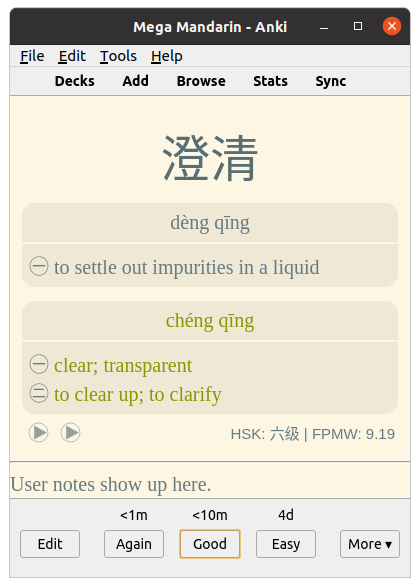

# Hướng dẫn tự học Tiếng Trung

**Ghi chú:** Bạn nên (_cần_) đọc [Hướng dẫn tự học ngoại ngữ đầy đủ này](https://daihocmo.github.io/ngoai-ngu/orca/giai-doan-0/) để hiểu về phương pháp học ngoại ngữ được trình bày trong trang này

Học tiếng Trung để xem C-drama mà không cần phụ đề, đọc manhua và tiểu thuyết, hoặc giao tiếp với người Trung đều đòi hỏi những kỹ năng nền tảng giống nhau: khả năng hiểu tiếng Trung tự nhiên thông qua việc đọc và nghe.

Để đạt được trình độ Tiếng Trung cao cần **rất nhiều thời gian**. Vậy nên, nguyên tắc cơ bản là:

## Dành càng nhiều thời gian cho Tiếng Trung càng tốt

Yếu tố cốt lõi quyết định tốc độ học Tiếng Trung của bạn là **thời gian**. Nếu bạn muốn giỏi nhanh hơn thì hãy đặt mục tiêu là dành nhiều thời gian nhất có thể để học. Càng nhiều càng tốt. Điều này còn quan trọng hơn nhiều việc có phương pháp học tập hay những nguồn tài nguyên tốt.

Để bắt đầu xây dựng thời gian cho việc học Tiếng Trung của cá nhân bạn, bạn cần phải học hàng ngày. Lý tưởng là dành ít nhất một tiếng mỗi ngày. Sẽ không có giới hạn thời gian, bạn càng dành nhiều thời gian, bạn càng trở nên giỏi nhanh hơn.

Trong lộ trình này, phần bạn sẽ dành nhiều thời gian nhất chính là việc tiêu thụ nội dung được làm ở Tiếng Trung của bạn, và nó cũng có thể là thứ mà bạn muốn làm nhất trong quá trình học Tiếng Trung bởi bạn sẽ là người chọn ra thứ mà bạn muốn xem/nghe/đọc.

Ở mỗi giai đoạn, mình sẽ giải thích tương đối về những nhiệm vụ mà bạn cần thực hiện. Phần hướng dẫn này sẽ tương đối ngắn và chỉ bao gồm những phần chính trong quá trình học Tiếng Trung thông qua Immersion. Nếu bạn cảm thấy chưa đủ và muốn đọc thêm để hiểu hơn về phương pháp học Tiếng Trung, bạn có thể đọc thêm các bài viết trên trang hoặc ghé trang [Hướng dẫn đề xuất](recommendations.md) để đọc thêm các hướng dẫn tương tự được viết bằng Tiếng Anh (Chắc chắn tốt hơn phần mình viết hoặc dịch lại nên nếu bạn có thể đọc Tiếng Anh đừng ngại qua đọc thêm nha).

## Hệ thống ngôn ngữ

Trước khi bắt đầu, chúng ta sẽ nói qua về _Chữ Hán phồn thể là gì? Giản thể là gì?_.

Chữ Hán phồn thể là hệ thống chữ viết truyền thống của Trung Quốc, với cấu trúc phức tạp, nhiều nét và ý nghĩa tượng hình cao, chủ yếu được sử dụng tại Trung Quốc Đài Loan, Hong Kong, và Ma Cao (nếu bạn muốn đọc các tài liệu cổ hay nghiên cứu sâu hơn về văn hóa lịch sử của Trung Quốc thì cần học phồn thể).

Chữ Hán giản thể là phiên bản được tối giản hóa của chữ Hán phồn thể nhằm tăng cường hiệu quả học tập và giảm tỷ lệ mù chữ. Được giới thiệu vào những năm 1950-1960 tại Trung Quốc Đại Lục, chữ giản thể đã giảm bớt số nét và đơn giản hóa cấu trúc của các ký tự để dễ viết và dễ học hơn. Chữ Hán giản thể được sử dụng chính thức tại Trung Quốc đại lục và Singapore.

{: style="display: block; margin: 0 auto; max-width:70%; height:auto;" }

*Chữ Hán giản thể có thể ít nét hơn hoặc khác hoàn toàn chữ phồn thể ([Nguồn ảnh](https://nihaoma-mandarin.com/vi/goc-hoc-tap/tieng-trung-gian-the-va-phon-the-la-gi/))*

Giờ chúng ta sẽ nói về _Tiếng Quảng Đông_ (廣東話 – Cantonese) và _Tiếng Phổ thông_ (普通话 – Mandarin, hay còn gọi là Tiếng Quan Thoại). Về cơ bản thì:

- Tiếng Phổ thông = ngôn ngữ chuẩn, ai học tiếng Trung đều phải học.
- Tiếng Quảng = ngôn ngữ địa phương, mang màu sắc riêng, nghe nhạc Cantopop hay xem phim Hong Kong thì bạn sẽ “cảm” ngay sự khác biệt.

Hướng dẫn này sẽ tập trung vào _Tiếng Phổ thông_ (普通话 – Mandarin).

### Chữ Hán và Pinyin

Hệ thống chữ viết chính ở Trung Quốc đại lục là chữ Hán (giản thể).

Bên cạnh đó còn có _Pinyin_ (拼音 – Bính âm): Là hệ thống dùng chữ Latinh để phiên âm, là công cụ không thể thiếu cho người mới. Đi cùng với nó là Thanh điệu (声调). Pinyin tương đối dễ học đối với những người đã quen với bảng chữ cái Latin.

Ví dụ:

- Chữ Hán: 火车站在哪里？
- Pinyin: Huǒchē zhàn zài nǎlǐ?
- Tiếng Việt: Ga tàu ở đâu?

{: style="display: block; margin: 0 auto; max-width:70%; height:auto;" }

Học nhanh về Pinyin trong gần 30 phút, có phụ đề Tiếng Việt, xem [tại đây](https://www.youtube.com/watch?v=XbZ8qqNi_sQ).

### Thanh điệu (声调)

Ta có 4 Thanh điệu chính + 1 Thanh nhẹ:

- Thanh 1 (¯): Âm cao, đều. (Ví dụ: mā – 妈 – mẹ)
- Thanh 2 (´): Âm đi lên. (Ví dụ: má – 麻 – tê)
- Thanh 3 (ˇ): Âm đi xuống rồi lên. (Ví dụ: mǎ – 马 – ngựa)
- Thanh 4 () : Âm đi xuống dứt khoát. (Ví dụ: mà` – 骂 – mắng)
- Thanh nhẹ (không dấu): Đọc nhẹ, ngắn. (Ví dụ: ma – 吗 – trợ từ nghi vấn)

{: style="display: block; margin: 0 auto; max-width:70%; height:auto;" }

Thanh điệu trong Tiếng Trung rất quan trọng, không khác gì dấu ở bên mình cả. Cũng giống như Tiếng Việt mình, sai dấu là dở :'). Đây là một số ví dụ:

- “hànyǔ” (汉语, tiếng Trung) vs. “hányǔ” (韩语, tiếng Hàn)
- “mǎi” (买, mua) vs. “mài” (卖, bán)
- “yǎnjīng” (眼睛, mắt) vs. “yǎnjìng” (眼镜, kính)

Bạn có thể xem video [4 thanh điệu - phát âm Tiếng Trung](https://www.youtube.com/watch?v=xUiCa25MsJ0) để nghe và học theo.

### Phát âm

Phát âm luôn quan trọng, dù là bạn học ngôn ngữ nào. Nhưng đối với tiếng Trung thì bạn phải đặc biệt chú ý khi học phát âm các thanh điệu, nguyên âm, phụ âm và cuối cùng là Pinyin. Tiếng Trung là một ngôn ngữ có thanh điệu, đổi thanh điệu sẽ đổi ý nghĩa của từ.

Việc học Pinyin vững không chỉ giúp ích cho việc nghe, mà bạn sẽ có thể tra từ điển một cách chính xác nếu nghe thấy một từ mới. Điều này sẽ càng thúc đẩy quá trình học của bạn tiến bộ.

## Học chữ Hán

Sau khi đã quen với Pinyin và phát âm cơ bản, bạn có thể bắt đầu học cấu trúc chữ Hán. Chữ Hán (汉字) là hệ thống chữ viết truyền thống của người Trung Quốc, ngày nay chữ Hán là chữ giản thể. Khác với tiếng Việt hay Tiếng Việt, chữ Hán không phải là bảng chữ cái. Chữ Hán là một hệ chữ biểu ý, mỗi ký tự sẽ có cách phát âm và ý nghĩa riêng.

{: style="display: block; margin: 0 auto; max-width:70%; height:auto;" }

Mình thấy kha khá nhiều người nói rằng nên bắt đầu học chữ Hán từ HSK4 trở đi hay đại loại là sau khi đã _tương đối giỏi_. Nhưng mình gợi ý bạn làm điều ngược lại, hãy học chữ Hán từ sớm. Điều này có hai lợi ích:

- Bạn có thể đọc tiếng Trung.
- Có rất nhiều chữ Hán có cùng cách phát âm (kể cả cùng thanh). Học chữ Hán giúp não bạn tách biệt các nghĩa khác nhau. Ví dụ, các chữ sau đều đọc là “shì”: 是 视 事 试 士 市 示 氏 世 柿 适 饰 势 室 实

### Bắt đầu từ bộ thủ

Bộ thủ tiếng Trung - 部首 /Bù shǒu/ là phần cơ bản cấu tạo nên chữ Hán và cả chữ Nôm. Một chữ Hán có thể được cấu tạo bởi một hoặc nhiều bộ thủ ghép lại. Hiểu đơn giản hơn, mỗi chữ Hán sẽ có một hoặc nhiều bộ phận tạo thành, mỗi bộ phận đó chính là bộ thủ. Trong nhiều chữ Hán, từ 214 bộ thủ, ta có thể suy đoán được sơ lược về ý nghĩa của từ và cả cách đọc chữ đó. Vì vậy, việc học bộ thủ cực kỳ quan trọng đối với người học.

{: style="display: block; margin: 0 auto; max-width:70%; height:auto;" }

Bạn hãy học qua [214 bộ thủ Tiếng Trung](https://prepedu.com/vi/blog/214-bo-thu-tieng-trung) thông qua trang đã được để đường dẫn (hoặc bất cứ chỗ nào bạn thích) rồi tải bộ thẻ Anki: [214 Bộ Thủ](https://ankivn.com/bo-the/ngoai-ngu/tieng-trung/214-bo-thu-hanzi-pinyin-sound-picture-han-viet/) và thêm vào Anki để ôn tập.

### Đừng học viết tay

Rõ ràng, việc có nên học viết tay hay không phụ thuộc vào mục tiêu của bạn. Nhưng bạn có thể tiết kiệm rất nhiều thời gian nếu không học, và nó ít quan trọng hơn bạn nghĩ:

Với máy tính và điện thoại, cách phổ biến nhất để nhập chữ Hán (ở Trung Quốc đại lục) là thông qua Pinyin: bạn gõ Pinyin (không dấu), máy sẽ hiển thị các chữ phù hợp và bạn chọn chữ mình muốn. Điều này có nghĩa là: nếu bạn biết Pinyin = cách phát âm của một từ và có thể nhận diện nó (thụ động), thì bạn có thể gõ được từ đó.

Trong thời hiện đại, việc có thể viết tay được không còn quá quan trọng nữa.

Tuy nhiên, nếu bạn **thực sự** muốn học viết tay (phân biệt rõ với việc viết trên máy nha) thì bạn có thể đọc qua bài [Quy tắc viết chữ Trung Quốc (Hán) nhanh và đẹp](https://toihoctiengtrung.com/cach-viet-tieng-trung) để tìm hiểu về quy tắc khi viết chữ Hán. Khi viết trên máy tính hay điện thoại thì bạn chỉ cần nhớ Pinyin của nó là được.

## Từ vựng

Rất khó để nói hết được tầm quan trọng của việc học từ vựng trong tiếng Trung. Với số lượng từ tiếng Trung khổng lồ cần học, bạn có thể tránh được rất nhiều nản chí ban đầu nếu bắt đầu từ những từ quan trọng nhất. Nhưng chọn thế nào? Chúng ta sẽ xem ba lựa chọn sau:

- Sử dụng bộ từ vựng theo yêu cầu của kỳ thi HSK.
- Tự tạo các bộ từ của riêng bạn.

### HSK

HSK (hànyǔ shuǐpíng kǎoshì, 汉语水平考试) có nghĩa là “Kỳ thi năng lực tiếng Trung”, là một kỳ thi tiêu chuẩn hóa do Cộng hòa Nhân dân Trung Hoa xây dựng. Hiện nay có hai phiên bản đáng quan tâm.

#### _HSK 2.0: 2010–2021_

Phiên bản 2.0 gồm 6 cấp độ (mỗi cấp bao gồm toàn bộ từ và chữ của các cấp trước):

|       | Words   | Characters |
| ----- | ------- | ---------- |
| HSK 1 | 150 từ  | 174 chữ    |
| HSK 2 | 300 từ  | 348 chữ    |
| HSK 3 | 600 từ  | 618 chữ    |
| HSK 4 | 1200 từ | 1064 chữ   |
| HSK 5 | 2500 từ | 1685 chữ   |
| HSK 6 | 5000 từ | 2663 chữ   |

#### _HSK 3.0: 2021–_

Phiên bản 3.0 được giới thiệu năm 2021. Phiên bản này gồm 9 cấp độ. Hiện vẫn đang tiếp tục được hoàn thiện, vì vậy HSK 2.0 vẫn đang phổ biến hơn. Tuy nhiên, đã có các danh sách từ vựng mà bạn có thể tải về.

|         | Words    | Characters |
| ------- | -------- | ---------- |
| HSK 1   | 500 từ   | 300 chữ    |
| HSK 2   | 1272 từ  | 600 chữ    |
| HSK 3   | 2245 từ  | 900 chữ    |
| HSK 4   | 3245 từ  | 1200 chữ   |
| HSK 5   | 4316 từ  | 1500 chữ   |
| HSK 6   | 5456 từ  | 1800 chữ   |
| HSK 7–9 | 11092 từ | 3000 chữ   |

Khá tiếc là HSK không ưu tiên những từ hữu dụng trong đời sống hằng ngày như 厕纸 (cè zhǐ) “giấy vệ sinh”. Tuy nhiên, rất nhiều tài liệu học (graded readers, v.v.) được phân cấp dựa trên HSK. Do đó, việc bám theo các cấp HSK vẫn rất hợp lý – ngay cả khi bạn không có ý định thi HSK.

### Bạn cần biết bao nhiêu từ?

Daniel Nalesnik, người sáng lập Hack Chinese, chia sẻ những gì ông có thể làm được với từng mức số lượng từ:

- 600 từ: khả năng giao tiếp hạn chế
- 1200 từ: xử lý được các việc như mua gói cước điện thoại, mở tài khoản ngân hàng, thanh toán hóa đơn.
- 2500 từ: giao tiếp hội thoại. Lưu ý: chưa thể đọc đa số sách dành cho người lớn. “việc hiểu tin tức trên TV thì lúc được lúc không, hầu hết bài báo vẫn đầy từ lạ, và ngay cả những cuộc trò chuyện ‘dễ’ đôi khi cũng có thể bị bỏ lỡ.”

### Để học từ vựng

Lặp lại ngắt quãng (spaced repetition) là một kỹ thuật học tập, thường sử dụng flashcard: mặt trước của thẻ là câu hỏi, mặt sau là câu trả lời. Trích [Wikipedia](https://en.wikipedia.org/wiki/Spaced_repetition): “Những thẻ mới hoặc khó sẽ được hiển thị thường xuyên hơn, trong khi những thẻ cũ và dễ sẽ xuất hiện ít hơn [...]”, bạn có thể đọc [Hệ thống lặp lại ngắt quãng](https://daihocmo.github.io/ngoai-ngu/srs/) để tìm hiểu thêm.

[Anki](https://apps.ankiweb.net/) là một ứng dụng phổ biến cho phương pháp này (Đọc [Hướng dẫn cài đặt và sử dụng Anki cơ bản](https://daihocmo.github.io/ngoai-ngu/anki/)). Mình gợi ý sử dụng bộ thẻ [HSK1-6 Vietnamese](https://ankiweb.net/shared/info/698824905). Nếu bạn biết Tiếng Anh thì có thể sử dụng bộ thẻ [HSK 1-6](https://old.reddit.com/r/ChineseLanguage/comments/7mjmjc/best_anki_deck_for_hsk_ive_come_across/)

Mình sử dụng Anki để học từ như sau:

- Mặt trước của flashcard là một từ tiếng Trung (chỉ có chữ Hán), có thể có thêm một câu ví dụ.
- Mặt sau gồm Pinyin, Từ Hán Việt và nghĩa Tiếng Việt. Mình cũng thường thêm câu ví dụ, từ liên quan và các ghi chú hữu ích khác.
- Điều đó có nghĩa là khi nhìn chữ, mình phải nhớ ra âm và nghĩa. Như vậy là đủ nếu mình đồng thời nghe tiếng Trung và đọc tiếng Trung (xem phần “comprehensible input” bên dưới).

Bạn phải cân bằng giữa việc tiến bộ và việc học quá nhiều từ mới mỗi ngày. Bạn sẽ phải ôn lại toàn bộ số từ mới đó, và mọi thứ có thể tích tụ rất nhanh. Hiện tại mình học khoảng 10 từ mới mỗi ngày. Việc các chữ lặp lại trong nhiều từ khác nhau và việc nhiều từ khá trực quan cũng giúp ích.

### Tra từ vựng trên trình duyệt/máy tính

Một số các ứng dụng từ điển trên máy tính bao gồm [Yomitan](https://yomitan.wiki/) (Tiện ích trình duyệt) và Goldendict (Ứng dụng xem từ điển trên máy tính). Hướng dẫn cài đặt từ điển: 

- [Yomitan](https://daihocmo.github.io/ngoai-ngu/yomitan/) - Tra nhiều từ điển cùng một lúc trên trình duyệt.
- [Goldendict](https://daihocmo.github.io/ngoai-ngu/goldendict/)
- [HanViet: Từ Điển Hán Việt](https://chromewebstore.google.com/detail/hanviet-t%E1%BB%AB-%C4%91i%E1%BB%83n-h%C3%A1n-vi%E1%BB%87t/gilnapfdconbpkkigjdedkcilaalfnjb?hl=vi) (Nếu mọi người không muốn sử dụng Yomitan thì có thể sử dụng tiện ích trình duyệt này).

[Hướng dẫn setup cho việc học Tiếng Trung](setup.md) - Sau khi bạn cài xong Anki, Goldendict và Yomitan ở trên thì hãy đọc hướng dẫn cài đặt này để hướng dẫn tận dụng các phần mềm đã được cài đặt ở trên

## Ngữ pháp

Bước đầu tiên sẽ giúp bạn chuẩn bị hành trang để ~~bước vào lớp 1~~ bắt đầu tiêu thụ nội dung Tiếng Trung của bạn. Có một số người cho rằng nên bắt đầu thực hành Immersion từ ngày đầu tiên, nhưng cá nhân mình gợi ý bạn nên dành một vài tuần đầu học từ vựng và ngữ pháp cơ bản. Trước hết sẽ có một số hướng dẫn/gợi ý sau đây:

1. Bạn không cần phải ghi nhớ hết toàn bộ tài liệu (resourcce) ngữ pháp mà bạn đang sử dụng để có thể bắt đầu immerse.
2. Bạn không cần phải hoàn thành bộ thẻ từ vựng trong Anki để bắt đầu immerse, có thể bắt đầu immerse khi bạn cảm thấy bây giờ bạn có thể (Càng sớm càng tốt).
3. Cách để hiểu ngữ pháp tốt nhất là có ngữ cảnh (bạn sẽ có được ngữ cảnh thông qua Immersion), và bạn vẫn nên học ngữ pháp trước khi bắt đầu Immersion
4. Phần lớn các hướng dẫn ngữ pháp đều có những lỗi và vấn đề nhất định. Vì vậy, nếu bạn đọc trong một nguồn mà không thấy hiểu, thử chuyển qua các hướng dẫn ngữ pháp khác xem.

Để bắt đầu việc học ngữ pháp thì bạn có thể chọn nhiều nguồn đọc khác nhau. Một nguồn duy nhất bằng Tiếng Anh mà mình tìm được (trên các diễn đàn tự học gợi ý nhiều, và vì nó hoàn toàn miễn phí nữa) là [Chinese Grammar Wiki](https://resources.allsetlearning.com/chinese/grammar/)

**Ghi chú**: Có thể bạn sẽ bất ngờ khi đọc điều này nhưng bạn không nên chờ đợi đến khi nào học giỏi đến một trình độ nào đấy để bắt đầu nghe Tiếng Trung, xem phim Trung hay đọc truyện Tiếng Trung mà bạn yêu thích. Bạn có thể bắt đầu ngay trong lúc mình đang học ngữ pháp và từ vựng. Điều đó càng giúp bạn yêu Tiếng Trung và có thêm động lực học.

## Tiêu thụ nội dung Tiếng Trung (Immersion)

Nếu bạn đã hoàn thành (hoặc gần xong) bộ thẻ từ vựng cơ bản ở Tiếng Trung đồng thời có một lượng hiểu ngữ pháp tương đối, chúc mừng bạn nha.

Có thể hiện tại bạn đang cảm thấy gần như không hiểu bất kì nội dung nào ở Tiếng Trung mục tiêu của mình. Điều này là hoàn toàn bình thường. Bạn vẫn chưa tiếp thụ được nhiều kiến thức về ngôn ngữ nhưng bạn đã học được tương đối rồi. Bây giờ là lúc bắt đầu hành trình thực sự. Bước này về cơ bản sẽ không bao giờ kết thúc vì càng tiêu thụ nội dung Tiếng Trung thì kĩ năng của bạn sẽ càng trở nên tốt hơn.

!!! question "Mình nên thực hành immersion bao lâu mỗi ngày?"
    Mình khuyên bạn nên dành khoảng 1 giờ đến 2 giờ khi bạn mới bắt đầu thực hành immersion. Bạn hoàn toàn có thể dành nhiều thời gian hơn thế và bạn sẽ tiến bộ nhanh hơn khi thực hiện immersion nhiều hơn mỗi ngày.

### Tạo bộ thẻ từ vựng của riêng mình (mining deck)

Phần việc chính của phần này là bạn cần bắt đầu xây dựng một bộ _mining deck_ (bộ thẻ mining). Một bộ thẻ mining là một bộ thẻ Anki bạn tự tạo mà khi thông qua các nội dung mà bạn tiêu thụ, bạn sẽ "đào" từ vựng từ câu mà bạn tiếp xúc trong lúc immerse.

Việc tạo một bộ thẻ mining là một chủ đề lớn và sẽ được giải thích kĩ hơn ở [bài viết về Sentence Mining](https://daihocmo.github.io/ngoai-ngu/sentence-mining/).

{: style="display: block; margin: 0 auto; max-width:80%; height:auto;" }

Bạn nên bắt đầu nghe Tiếng Trung càng sớm càng tốt. Bạn có thể tìm gợi ý nội dung để tiêu thụ ở trong trang [Tài nguyên](resources.md) thông qua các hướng dẫn của Refold hoặc các trang gợi ý riêng. Tìm nội dung bạn thích, bất kì thứ gì miễn là ở Tiếng Trung của bạn. Ban đầu, khả năng nghe của bạn sẽ kém hơn khả năng đọc rất nhiều. Và nếu có thể, thử đi tìm người bản ngữ để thực hành output (nói, viết) cùng. Sẽ thích hơn rất nhiều và cũng sẽ giúp cho bạn có động lực học.

Tiện ích trình duyệt (extension) [Yomitan](https://yomitan.wiki) giúp đơn giản hóa quá trình mining chỉ với một cú nhấp chuột: bạn chỉ cần di chuột lên một từ và bấm nút + trong cửa sổ bật lên để tạo thẻ trong Anki.

!!! info "Combo đọc thần thánh"
    Bạn có thể đọc sách Tiếng Trung sử dụng [Ttsu Reader](https://reader.ttsu.app/manage) và tra từ trực tiếp trong khi đọc trên trang Ttsu Reader bằng [Yomitan](https://chromewebstore.google.com/detail/yomitan-popup-dictionary/likgccmbimhjbgkjambclfkhldnlhbnn?pli=1). Thử xem.

### Ngữ pháp nâng cao

Ở giai đoạn này, có thể bạn sẽ muốn học thêm ngữ pháp nâng cao. Tùy vào ngôn ngữ bạn học mà có thể tìm được các hướng dẫn ngôn ngữ nâng cao. Cách mà cá nhân mình (là tác giả gốc của bài viết - donkuri) học ngữ pháp là:

1. Bắt gặp một mẫu ngữ pháp lạ trong lúc đọc.
2. Tìm kiếm về mẫu ngữ pháp trên mạng.
3. Ghi lại mẫu ngữ pháp đấy vào một danh sách riêng của bạn hoặc chỗ nào bạn muốn.
4. Ôn tập thường xuyên

## Comprehensible Input

_Comprehensible input_ (đầu vào dễ hiểu) là một khái niệm trong việc học ngôn ngữ: nhà ngôn ngữ học Stephen Krashen cho rằng việc tiếp nhận _đầu vào_ (input, ý chỉ nghe và đọc) có độ khó chỉ nhỉnh hơn một chút so với trình độ hiện tại của người học là cách tốt nhất để học ngôn ngữ. Loại input như vậy được gọi là _comprehensible input_. Xem thêm tại [mục Wikipedia về _monitor model_ của Krashen](https://en.wikipedia.org/wiki/Input_hypothesis).

Việc nói có thể để sau. Một số chuyên gia thậm chí khuyên là ta nên trì hoãn việc output (nói và viết) và ban đầu tập trung vào input (nghe & đọc) – tương tự như cách trẻ con học tiếng mẹ đẻ. Tuy nhiên, thỉnh thoảng mình tự nói chuyện với chính mình bằng tiếng Trung.

*Quá trình học Tiếng Trung* mỗi ngày chỉ đơn giản là immersion thật nhiều (comprehensible input, hoặc bất kì thứ gì bạn thích) và học từ và ngữ pháp. Bạn thực sự có thể thông thạo Tiếng Nhật bằng phương pháp này. Nhưng có một điều sẽ thay đổi khi bạn không còn ở giai đoạn mới bắt đầu.

### Đọc phân cấp (graded readers)

Graded readers là các cuốn sách dành cho người học ngoại ngữ, chỉ sử dụng một lượng từ vựng hạn chế. Chúng thường ghi rõ cấp độ ngôn ngữ mà sách hướng tới (do đó gọi là “graded”). Graded readers là nguồn comprehensible input rất tốt. Về nguyên tắc, bạn thậm chí có thể (phần nào?) tự động hóa việc diễn đạt lại các từ phức tạp bằng những cách nói đơn giản hơn.

Graded readers tiếng Trung thường được xếp theo cấp HSK. Tài nguyên:

- [“Graded Chinese Readers”](https://www.gradedchinesereaders.com/) liệt kê các bộ sách.
- Bài đánh giá nhiều bộ sách: [“Chinese Graded Novels: Books for not-quite-beginners”](https://lahlahbanana.com/2022/04/27/chinese-graded-novels-readers-review/).
- Sách của [Mandarin Companion](https://mandarincompanion.com/)

Ngoài ra còn có các website cung cấp văn bản phân cấp:

- [“Mandarin Bean”](https://mandarinbean.com/)
- [“HSK Reading”](https://hskreading.com/)

Bạn cũng có thể tìm trên web với các cụm như “graded reader Chinese” hoặc “HSK 1 text Chinese”.

### YouTube

Có rất nhiều nội dung hữu ích trên YouTube. Mình gợi ý một số kênh Youtube sau (từ trình độ sơ cấp đến trung cấp):

- [Kênh Peppa Pig tiếng Trung chính thức (= do chính đội lồng tiếng bản gốc thực hiện)](https://www.youtube.com/@PeppaPigChineseOfficial)
- [Lazy Chinese – Comprehensible Input](https://www.youtube.com/@comprehensiblechinese)
- [Comprehensible Mandarin](https://www.youtube.com/@ComprehensibleMandarin)
- [Story learning Chinese with Annie](https://www.youtube.com/@annieluo1307)
- [Mandarin Corner](https://www.youtube.com/@MandarinCorner2)
- [Rita Mandarin Chinese](https://www.youtube.com/@RitaChinese)
- [Easy Mandarin](https://www.youtube.com/@EasyMandarin)

Bạn cũng có thể tìm trên YouTube với các từ khóa như “comprehensible Chinese”, “easy Chinese”, “slow Chinese”, v.v.

### Nội dung nâng cao có phụ đề Tiếng Việt

Mình cũng học được rất nhiều từ nội dung tiếng Trung có phụ đề Tiếng Việt. Trước đây mình nghĩ mình sẽ chỉ chú ý vào phụ đề mà không nghe tiếng Trung, nhưng thực tế không phải vậy: mình vẫn vô tình tiếp thu được khá nhiều từ.

### Phim hoạt hình và series hoạt hình: donghua

Từ tiếng Trung cho “hoạt hình” là 动画 (dònghuà) – có thể coi như “anime Trung Quốc”. Nếu bạn tìm từ này trên YouTube, bạn sẽ thấy rất nhiều nội dung hay. Đây là một số donghua mình thích (đều xem miễn phí trên YouTube):

- [“The Infinitors”](https://www.youtube.com/watch?v=0HfwdLvoG_4) – trích mô tả: “Một nhân viên văn phòng kiệt sức nhận được lời mời bí ẩn: ‘Bạn có muốn biết ý nghĩa của cuộc sống không? Bạn có muốn thực sự sống không?’ Anh ta bị dịch chuyển đến không gian luôn thay đổi của Thượng Đế. Một lời mời và thử thách được gửi từ con người trong tương lai về thế giới hiện tại. Khi loài người tiến vào vũ trụ, những thử thách họ gặp phải được chuyển hóa thành các ‘phó bản’ để những người được chọn vượt qua. Băng qua vô số cạm bẫy. Gặp được đồng đội đáng tin cậy. Trở thành thủ lĩnh đội nhóm. Tất cả vì sự tiến hóa và tồn tại của nhân loại và tương lai vô hạn!”
- [“Time Prisoner”](https://www.youtube.com/watch?v=5hsixF8Nw6M) – Google dịch một phần mô tả: “Năm 2060, Tổ chức Thế giới chọn các đặc vụ tinh nhuệ từ khắp nơi để thành lập Cục Khủng hoảng nhằm giải quyết các cuộc khủng hoảng siêu nhiên. Cục Khủng hoảng chọn ra tinh hoa trong tinh hoa để lập nên đội át chủ bài mang tên Phantom.”

### Mandodrama, CDrama

Phim truyền hình Trung Quốc (đa số là người đóng) được gọi là Mandodrama và CDrama. Bạn cũng có thể tìm và xem trên YouTube.

### Podcast

- [“TeaTime Chinese”](https://teatimechinese.com/) là một podcast nói về nhiều chủ đề khác nhau bằng tiếng Trung đơn giản, dễ hiểu.
- [“Every little thing Chinese”](https://www.youtube.com/playlist?list=PL1SoADOGl5fsy5TDj8vueArNJnrU8SEWJ) là podcast dành cho người học ở trình độ HSK 2. Có mặt trên các nền tảng podcast lớn (đầy đủ tập) và trên YouTube (một số tập).

## Output nhiều hơn nữa

Một khi bạn có mức hiểu tương đối tốt về Tiếng Trung và có thể đọc một cách dễ dàng hơn, đã đến lúc tập speaking với người bản ngữ thường xuyên hơn rồi. Điều này cũng tương tự cho việc tập viết (Không nhất thiết phải viết trên giấy) và có người sửa sai cho bạn. Điều này không có nghĩa là bạn không thể output từ sớm. Nếu bạn có cơ hội output từ sớm, bắt đầu luôn cũng không vấn đề gì, nhưng nhớ là [cần phải Immersion song song](https://daihocmo.github.io/ngoai-ngu/speaking). **Chỉ giỏi đọc là chưa đủ để giỏi viết**, và điều này cũng tương tự với việc nói, **chỉ giỏi nghe là chưa đủ để giỏi nói**. Tuy chưa đủ nhưng chúng là điều kiện cần để bạn có thể giỏi Output, bản thân Output (Nói, Viết) không phải là cách học Tiếng Trung mà Input (Nghe, Đọc) mới chính là học Tiếng Trung. Về phần này bạn có thể đọc câu trả lời cho câu hỏi [Is it bad if I make a mistake when speaking?](http://learnjapanese.moe/faq/#is-it-bad-if-i-make-a-mistake-when-speaking) và bài viết [Nói Tiếng Anh](https://daihocmo.github.io/ngoai-ngu/speaking/)

Có khá nhiều nền tảng có thể giúp bạn tìm được người Trung để bắt chuyện chém gió. Nếu bạn đã học được Tiếng Trung được đến giai đoạn này thì hãy thử sức giao tiếp với người Trung xem.

## Từ giờ cho đến về sau

Làm bất kì điều gì bạn muốn. Thi chứng chỉ Tiếng Trung (HSK) thử xem nếu bạn muốn, đó là một cột mốc đánh dấu nỗ lực của bản thân. Bạn có thể làm bất kì điều gì bạn muốn với Tiếng Trung.

### Danh sách nhiệm vụ

Những thứ bạn cần làm:

1. Học Pinyin và bộ thủ
2. Hoàn thành bộ thẻ từ vựng cơ bản và một hướng dẫn ngữ pháp
3. Cài đặt các công cụ cần thiết, xây dựng môi trường học Tiếng Trung.
4. Tạo một bộ thẻ mining sau khi hoàn thành bộ thẻ từ vựng cơ bản
5. Nạp thêm thật nhiều Input
6. Thử Output với người bản ngữ Tiếng Trung.

## Tham khảo

- [My system for learning Mandarin Chinese (10 tips)](http://www.langtales.de/2024/09/chinese-learning-tips.html)
- [Main Guide - Immersion-Based Japanese Learning (donkuri)](https://donkuri.github.io/learn-japanese/guide/)
- [Refold Mandarin](https://zenith-raincoat-5cf.notion.site/Mandarin-Guide-82734307494a429c9ccf0b98e1d8a80c)
- [DJT Guide](https://djtguide.neocities.org/)
