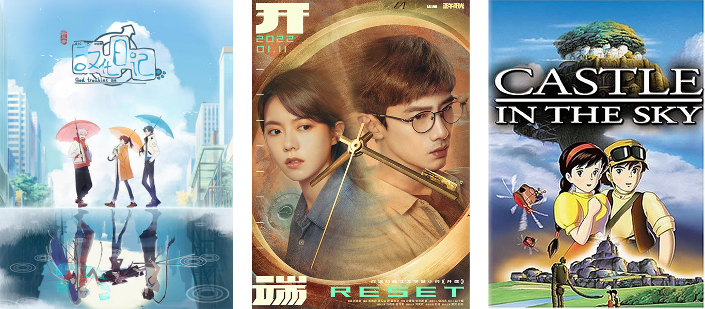
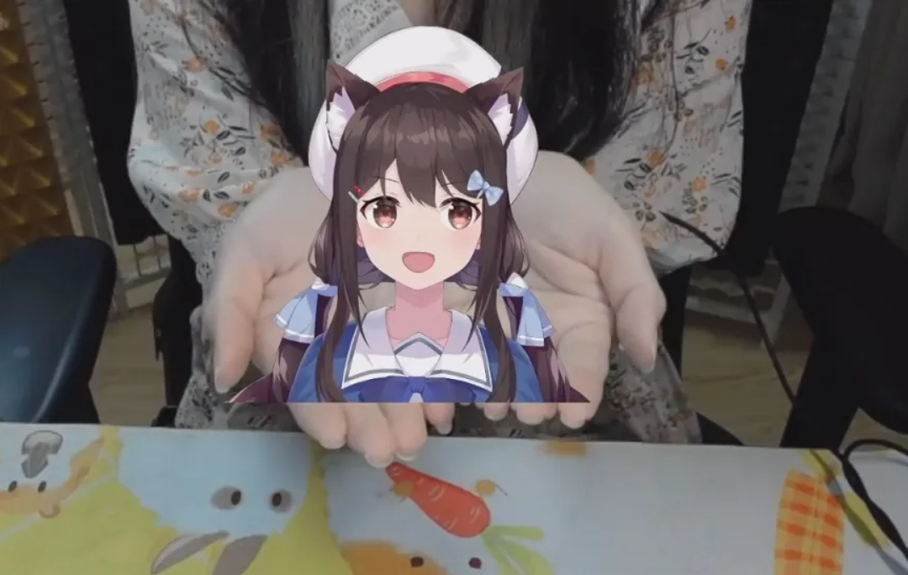
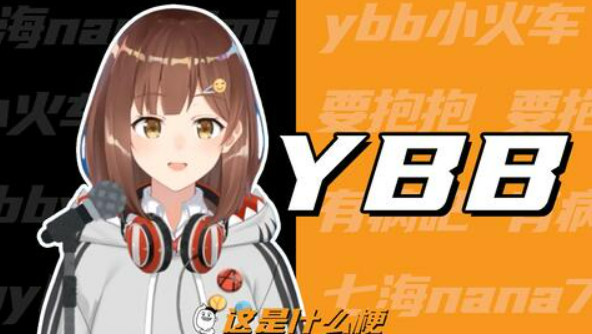

# Immersion Tiếng Trung

## Đọc

### Manhua

Sau khi đọc xong graded readers nhưng trước khi bắt đầu đọc sách, mình đã đọc khá nhiều manhua. Bộ duy nhất mình đọc hết là **今天的她也是如此可爱 \[Jin Tian De Ta Ye Shi Ru Ci Ke Ai - She is Still Cute Today\]**, một bộ romcom GL lấy bối cảnh học đường. Mặc dù đặt các nhân vật vào rất nhiều tình huống khác nhau, mình cảm thấy ngôn ngữ được sử dụng trong bộ này khá đơn giản, và mình có thể chân thành đề xuất nó. Dù các yếu tố lãng mạn hay những phần cảm xúc đôi khi không thật sự chạm tới mình, nhưng rất nhiều chương thiên về hài hước đã khiến mình cười đến chảy nước mắt.

### Light Novels, Visual Novels, Web Novels, Novels

Phần lớn thời gian đọc của mình bị chiếm bởi các bản dịch của một series light novel tiếng Nhật, và mặc dù mình đã bắt đầu rất nhiều cuốn, mình vẫn chưa thực sự hoàn thành được cuốn sách gốc tiếng Trung nào. Tính đến hiện tại, mình đã bỏ dở khoảng 20 web novel (các truyện dài dạng đăng nhiều kỳ của tác giả nghiệp dư) ngay trong 5 chương đầu, nhưng vẫn có một vài bộ mà mình thích đủ để muốn quay lại đọc tiếp trong tương lai.

Một visual novel (về cơ bản là game mà 98% thời gian là đọc) mà mình đã chơi được khá xa là **WILL：美好世界 \[WILL: A Wonderful World\]**. Đây là một tuyển tập các câu chuyện ngắn có liên kết với nhau, trong đó bạn cần hoán đổi thứ tự các sự kiện trong từng câu chuyện hoặc hoán đổi sự kiện _giữa_ các câu chuyện với nhau để tiếp tục tiến triển. Trò chơi trở nên rất u tối rất thường xuyên (nếu không thì cần gì phải sửa các câu chuyện?), nên mình không gợi ý mọi người chơi, nhưng với mình thì đây là một trải nghiệm tuyệt vời. Nó không quá dễ, nhưng có thể dùng được (ở mức độ nào đó) với Textractor, một chương trình trích xuất văn bản từ game để bạn có thể tra từ và tạo thẻ Anki. Nói chung thì visual novel là thể loại mà mình hào hứng nhất, vì đây là một dạng nội dung mà trước giờ mình cũng chưa dành nhiều thời gian cho cả bằng tiếng Anh lẫn tiếng Nga.

Mình cũng rất háo hức với vô số tiểu thuyết xuất bản thông thường, nhưng chúng có vẻ giống như “trùm cuối” xét trên tỷ lệ giữa độ khó và mức độ giải trí. Hiện tại mình đang đọc được khoảng 1/4 cuốn **活着 \[Huo Zhe - To Live\]**, hay còn được gọi là “cuốn tiểu thuyết đầu tiên của mọi người học tiếng Trung”, và tất nhiên là ba cuốn sách giấy thật mình mua ở New York vẫn đang nằm đó nhìn mình từ phía bên kia căn phòng.

## Nghe

### Tài liệu cho người học

Mình khá vui vì đã không còn phụ thuộc vào graded readers nữa, nhưng vẫn thường xuyên quay lại với **TeaTime Chinese Podcast**, **Chinese Podcast With Shenglan**, và **Peppa Pig**. Tất cả đều vừa dễ hiểu vừa ít nhiều có tính giải trí. Trên Bilibili có nhiều tập Peppa Pig hơn so với mình tìm thấy trên YouTube, và hiện tại mình đang dự định xem hết tất cả các tập đó mà không có phụ đề, sau đó sẽ xem tiếp toàn bộ các tập của **Bluey**, một chương trình thiếu nhi khác.

### YouTube & Bilibili

Trong vài tuần liền, gần như ngày nào mình cũng xem **王志安 \[Wang Zhi An\]**, một cựu nhà báo của CCTV (Đài Truyền hình Trung ương Trung Quốc) hiện sống lưu vong tại Tokyo, và thường xuyên “sentence mine” khá nhiều từ vựng từ video của ông bằng ASBPlayer. Ông đưa tin về rất nhiều câu chuyện thú vị, chủ yếu liên quan đến Trung Quốc và cộng đồng người Hoa ở nước ngoài, và cũng là một trong những nhà báo Trung Quốc đầu tiên đến Ukraine sau khi Nga xâm lược. Việc hiểu các video của ông đòi hỏi rất nhiều công sức, và nhiều từ vựng mình khai thác được cũng không mấy hữu dụng trong những bối cảnh khác, nên hiện tại mình đã tạm dừng xem kênh này.

Phần lớn nội dung mình xem trên Bilibili tất nhiên là let’s play game. Trước đây khi học tiếng Nga mình đã xem quá nhiều video du lịch nên giờ không còn mặn mà lắm, còn các video về nhập vai bàn giấy, lập trình, lịch sử, v.v. thì vẫn có vẻ quá tầm với, nên thật sự mình cũng không biết nên xem gì khác. Hiện tại mình tự đặt nhiệm vụ cho bản thân là xem tất cả các game Zelda từng được phát hành.

### Donghua, Anime, Phim truyền hình

Mình đã xem rất nhiều bản lồng tiếng Trung của anime Nhật, vài bộ donghua, và một vài phim truyền hình.

Có vẻ như tất cả các phim anime của Studio Ghibli đều có bản lồng tiếng Đại Lục khá ổn, nên mình đã lần lượt xem những bộ trước đây mình chưa từng xem. **Castle in the Sky** là một cú hit lớn đối với mình — hiện tại nó dễ dàng trở thành phim Ghibli yêu thích nhất của mình. Trong số các series anime mình xem, mình đặc biệt thích **Girls' Last Tour** — bối cảnh hậu tận thế u ám, trống trải được cân bằng bởi thái độ vô tư và tò mò của các nhân vật chính, và bộ này mang lại cho mình một cảm giác bình yên rất bất ngờ.

Mình vẫn chưa xem nhiều donghua nổi tiếng và được đánh giá cao — mình vẫn có cảm giác rằng nếu xem chúng mà không tập trung 110% và tra cứu rất nhiều thì sẽ là phí phạm — nên đôi lúc mình cảm thấy như đang lạc giữa một đống rác. Sau khi phải chịu đựng một bộ khá tệ, mình đã đầu hàng và xem **风铃玉秀 \[Feng Ling Yu Xiu - Soulmate Adventure\]**, và đúng như dự đoán, nó lập tức nhảy lên vị trí donghua yêu thích nhất của mình. Bốn tập đầu chỉ là một dự án indie tâm huyết, mỗi năm ra một tập, và dù hoạt họa có chùng xuống ở vài chỗ, rất nhiều cảnh hành động trông cực kỳ ấn tượng, sáng tạo và mượt mà, thiết kế nhân vật thì ngầu, câu chuyện vừa đơn giản vừa cuốn hút, và dĩ nhiên là cặp nhân vật chính cực kỳ đáng yêu bên nhau — đang nóng lòng chờ mùa 2!

Một số donghua khác để lại ấn tượng với mình là:

- **汉化日记 \[Han Hua Ri Ji - God Troubles Me\]**, một bộ hài đời thường “cười đau ruột” về một nữ nhân viên văn phòng trẻ tuổi cùng con mèo và chiếc điện thoại của cô, những thứ sau đó biến thành các vị thần. Mặc dù mình rất thích bộ này, nhưng sau 3 mùa thì mình cảm thấy đội ngũ làm phim bắt đầu cạn ý tưởng với dàn nhân vật và mô-típ hiện tại, nên mình hy vọng mùa 4 sẽ mang đến một luồng gió mới.
- **凸变英雄 LEAF \[Tu Bian Ying Xiong LEAF - To Be Heroine\]**, một bộ có rất nhiều ý tưởng pha trộn thể loại thú vị nhưng lại không kết nối được chúng một cách trọn vẹn, có một bài ending cực kỳ bắt tai, và sở hữu sự kết hợp giữa một số đoạn hoạt họa tệ nhất và tốt nhất mà mình từng thấy. Một số trận chiến thì vô cùng ấn tượng, nhưng có cả những tập mà chất lượng ngang với các animation Flash Newgrounds lười biếng nhất của thập niên 2000. Điều này xuất hiện ở khá nhiều donghua, nhưng với mình thì đây là ví dụ tệ nhất.
- **无限少女 48 \[Wu Xian Shao Nv 48 - Infinite\]**, một bộ idol pha phong cách CGDCT-ish (cute girls doing cute things – các cô gái dễ thương làm những điều dễ thương) xoay quanh bốn cô gái đến từ những thế giới khác nhau. Bộ này không quá xuất sắc, nhưng nổi bật ở chỗ là một trong số rất ít tác phẩm Trung Quốc thuộc những thể loại này.
- **黑白无双 \[Hei Bai Wu Shuang - The Unparalleled Black and White\]**, một bộ thiên về giả tưởng/hành động với một số nhân vật và xây dựng thế giới khá ngầu dựa trên thần thoại Trung Hoa mà mình rất thích trong vài tập đầu, nhưng đến mùa 2 và 3 thì cảm giác như một tai nạn kéo dài, và mình hoàn toàn mất dấu các tuyến truyện. Dù vậy, Lushu và Zhongkui vẫn ngầu cực kỳ; họ đáng lẽ nên là nhân vật chính.

Rất khó để tìm được các phim truyền hình không phải cổ trang hoặc hình sự (những thể loại mà mình thấy quá khó) nhưng vẫn hợp gu mình. Tuy nhiên **开端 \[Kai Duan - Reset\]** là một chuyến đi vừa điên rồ vừa tương đối dễ hiểu, và mọi người Trung Quốc mà mình hỏi qua đều biết đến bộ này. Đây là một câu chuyện bí ẩn vòng lặp thời gian trên một chiếc xe buýt, và mình không muốn tiết lộ thêm nữa.

Một bộ ít nổi tiếng hơn mà mình thích là **今天不是最后一天 \[Jin Tian Bu Shi Zui Hou Yi Tian - Definitely Not Today\]**, một bộ lãng mạn hài đen. Phim xử lý một số chủ đề u tối khá nhẹ nhàng, nên nếu bạn thấy điều đó có thể gây khó chịu, hãy kiểm tra tag trên MyDramaList trước khi xem.

### VTubers

Trong giai đoạn này mình cũng xem khá nhiều vtuber Trung Quốc (streamer/nhà sáng tạo nội dung sử dụng avatar ảo), và muốn nhắc đến một vài người mình thích nhất cho tới nay:

#### [Shourei 小 N \[Shourei Xiao N\]](https://space.bilibili.com/249118/)

Ban ngày là một diễn viên lồng tiếng nổi tiếng (hơn 1,5 triệu người theo dõi trên Bilibili!), ban đêm là vtuber, 小 N là giọng của một số nhân vật trong Genshin Impact, Sombra trong bản Trung của Overwatch, và Anya trong bản lồng tiếng Đại Lục của Spy x Family. Cô ấy chơi Valorant rất tệ theo cách mà mình thấy khá vui để xem, mình cũng khá thích tiếng cười “huhhuhhuhhuh” của cô, và thấy cô dễ nghe hơn nhiều streamer khác mà mình từng thử xem.

Phần lớn VOD stream của cô không có trên trang Bilibili chính, nhưng bạn có thể tìm thấy chúng nếu tìm kỹ một chút trên [Bilibili](https://space.bilibili.com/354032) hoặc [YouTube](https://www.youtube.com/channel/UCD62bCRhTs33ayp1bBg9WmA).

#### [爱哥 \[Ai Ge\]](https://space.bilibili.com/484322035)

Một vtuber Trung Quốc độc lập được tách nhánh từ vtuber Nhật nổi tiếng Kizuna AI. Ban đầu giọng của cô ấy khiến mình hơi khó chịu, nhưng cô có cả một núi video được hard-sub với nội dung cực kỳ đa dạng, và có vẻ như đội ngũ của cô luôn bắt kịp các xu hướng và meme mới nhất ở Trung Quốc. Những video mình thích nhất là khi cô được chở đi vòng vòng trên một màn hình/tablet TV, do sự tương phản hài hước giữa một nhân vật hoạt hình hoạt bát, ngớ ngẩn và những người thật ngoài đời đang tỏ ra ngơ ngác.

#### [中单光一 \[Zhongdan Guangyi\]](https://space.bilibili.com/434401868/)

_Note: Các thành viên của VirtuaReal thường dùng tên kiểu Nhật, nhưng mình để ý rằng khi họ nói chuyện với nhau, họ có xu hướng dùng cách đọc tiếng Quan Thoại, nên mình dùng cách đọc đó._

Guangyi là thành viên của VirtuaReal, chi nhánh Trung Quốc của Nijisanji. Mình từng mê Dota 2 trong một thời gian dài, và các buổi stream Dota 2, watchalong giải đấu, và phân tích replay chiếm khoảng 75% nội dung của anh ấy. Ngoài ra anh ấy cũng thỉnh thoảng stream video khác, hoặc chỉ trò chuyện, hoặc xuất hiện trên kênh của các thành viên VirtuaReal khác. Mình khá thích giọng của anh và kiểu hài hước mà mình có thể cảm nhận được dù vốn tiếng Trung còn hạn chế.

#### [惑姬 Waku \[Huoji Waku\]](https://space.bilibili.com/472877684/)

Một thành viên VirtuaReal, thỉnh thoảng stream game hoặc hát, nhưng chủ yếu làm nội dung trò chuyện, và mình cực kỳ thích giọng của cô ấy! Cô từng làm một số buổi [đọc sách/tiểu luận](https://www.bilibili.com/video/BV1864y1i7cc) trên stream và khoảng 4 tập [podcast](https://www.bilibili.com/video/BV1sE411h7qa/) mà mình đã sentence mine rất nhiều và nghe đi nghe lại cả chục lần cho đến giờ.

#### [七海 Nana7mi \[Qihai Nana7mi\]](https://space.bilibili.com/434334701/)

Thành viên VirtuaReal và là một trong những vtuber Trung Quốc nổi tiếng nhất. Giọng của cô ấy dễ thương, có rất nhiều meme về cô xuất hiện khắp Bilibili, và cô chơi rất nhiều game.

Qihai và XiaoN đều rất năng động trên Weibo (Twitter Trung Quốc) và thường đăng khá nhiều nội dung đời sống hằng ngày dễ hiểu, nên họ đã trở thành nguồn immersion ưa thích của mình khi đứng xếp hàng hoặc chờ tới lượt phát biểu trong các cuộc họp.

([nguồn bài viết](https://atian.bearblog.dev/1-year-mandarin/))