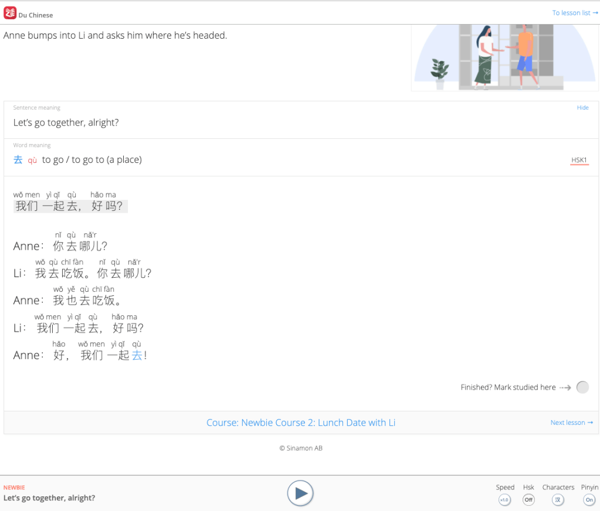
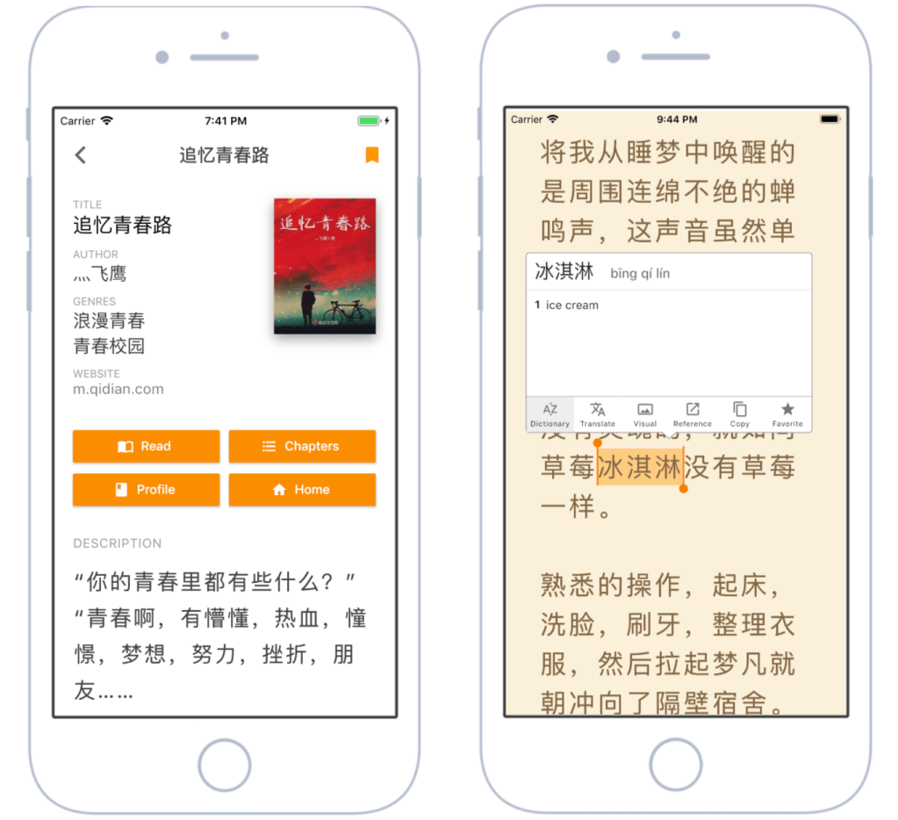

# Đọc Tiếng Trung

## Đọc cho người mới học

_Phần này sẽ tập trung vào graded readers_

bạn đã bao giờ nghĩ: “chết thật, ước gì mình có thể đọc được bằng ngôn ngữ mục tiêu rồi, nhưng nó khó quá!” chưa?

và đó là lúc – **graded readers** – xuất hiện. trong hành trình học của bạn, chắc chắn sẽ có lúc bạn nảy ra ý định thử đọc một cuốn tiểu thuyết bằng ngôn ngữ đang học. bạn cầm sách lên, đọc câu đầu tiên… rồi muốn ném nó ra ngoài cửa sổ. mình đã từng làm y như vậy với cuốn sách native đầu tiên của mình: harry potter bản tiếng trung, haha. khi chúng ta bước ra khỏi nội dung cho người mới bắt đầu và tiến vào các nội dung nâng cao hơn, ta cần một cây cầu nối giữa giáo trình và tiểu thuyết bản ngữ. graded readers chính là cây cầu đó.

graded readers là các cuốn sách hoặc bài đọc được thiết kế để giúp bạn chuyển dần từ nội dung sơ cấp sang nội dung nâng cao hoặc bản ngữ theo cách _dễ hiểu_. chúng giới hạn lượng từ vựng được sử dụng, nhờ đó rào cản tiếp cận thấp hơn. có một điều khá khó nhận ra cho tới khi bạn thực sự “lao vào lửa”: **chỉ vì bạn biết nghĩa của một từ, không có nghĩa là bạn biết cách dùng nó.** chuyển từ “biết định nghĩa” sang “biết sử dụng” là một kỹ năng riêng, và nó cần thời gian để phát triển.

trong quá trình học, bạn đã bao giờ đọc một đoạn, biết hết tất cả các từ, nhưng vẫn không hiểu chuyện gì đang xảy ra chưa? ngôn ngữ luôn bị chi phối bởi ngữ cảnh, và bạn cần học cách đọc mọi thứ trong bối cảnh của một câu chuyện lớn hơn để rèn khả năng xử lý sự mơ hồ, cũng như suy ra ý nghĩa từ sắc thái và ngầm định.

**đọc là một trong những cách hiệu quả nhất để nâng cao trình độ ngôn ngữ.** bạn có để ý rằng những người đọc nhiều thường trông khá “thông minh” không? tất nhiên, trí thông minh không phụ thuộc vào việc đọc, nhưng đọc giúp bạn tiếp xúc với từ mới, khái niệm mới và lối sống mới. ngoài ra, chúng ta cũng nhớ những câu chuyện thú vị, hấp dẫn dễ hơn rất nhiều so với danh sách từ khô khan hay các lời giải thích lý thuyết.

quan điểm của mình là: bạn học từ vựng và ngữ pháp ở mức cơ bản trước, rồi **trải nghiệm và củng cố** chúng thông qua việc đọc. đây cũng là lý do mình dùng giáo trình HSK. sau HSK1, về cơ bản chúng giống như các graded readers ngắn. tuy vậy, graded readers không phải là thứ bắt buộc. bạn hoàn toàn có thể luyện extensive reading với nội dung bản ngữ, chỉ là nó sẽ khó hơn nhiều, đặc biệt khi bạn còn ở trình độ thấp. khi lên trình độ cao hơn, bạn sẽ ngày càng ít cần graded readers, vì bạn đã có thể hiểu nội dung native rồi.

**graded readers : _phù hợp nhất cho người học sơ cấp và trung cấp_**  
hiện nay có rất nhiều graded readers, vậy chọn cái nào? điều quan trọng nhất là câu chuyện phải **khiến bạn muốn đọc** — hoặc ít nhất là đủ thú vị để bạn tiếp tục. ngay cả khi bạn không quá quan tâm tới nội dung, _biết đâu chỉ riêng việc “mình đang đọc được” cũng đã đủ tạo động lực rồi!_ hãy tìm những bộ được chia theo cấp độ hoặc theo số lượng từ vựng để bạn dễ xác định mức độ phù hợp với mình. một cuốn sách vượt xa trình độ đọc hiểu của bạn thì gần như không giúp ích gì.

đa số graded readers cũng có danh sách từ vựng hoặc giải thích ngữ pháp. chúng rất tiện cho việc tra nhanh, nhưng không bắt buộc nếu bạn quen dùng từ điển như pleco. một số còn có câu hỏi kiểm tra hiểu bài, cũng rất tốt. cá nhân mình chỉ dùng chúng như cách kiểm tra nhanh xem mình hiểu đến đâu, nên không dành quá nhiều thời gian cho phần này.

điều duy nhất cần lưu ý là hầu hết graded readers đều mất tiền (mua lẻ hoặc theo dạng thuê bao). vẫn có một số lựa chọn miễn phí, nhưng thường khá hạn chế. mình đã chọn ra những bộ mà mình thấy hữu ích nhất, nhưng ngoài kia vẫn còn nhiều lựa chọn khác.

### graded readers online / trên app

cá nhân mình khuyên dùng du chinese và the chairman’s bao trên app của họ (giao diện tốt hơn).

{: style="display: block; margin: 0 auto; max-width:50%; height:auto;" }

**[mandarin bean](https://mandarinbean.com/) (bao phủ HSK 1–6)**

hỗ trợ cả chữ giản thể và phồn thể. có gói miễn phí và gói trả phí. gói miễn phí bao gồm pinyin (có thể bật/tắt), chữ hán, và audio giọng người bản xứ. gói trả phí có thêm ghi chú, bản dịch, và tài liệu học có thể tải xuống. ngoài ra còn có một khóa học ngữ pháp HSK.

{: style="display: block; margin: 0 auto; max-width:50%; height:auto;" }

**[HSKreading](https://hskreading.com/about-us/) (bao phủ HSK 1–6)**

hỗ trợ chữ giản thể. khi rê chuột lên một từ, hệ thống sẽ hiện pinyin và nghĩa, bao gồm cả nhiều nghĩa khác nhau của cùng một từ (có thể hơi rối với người mới). một số bài có audio. có bản dịch tiếng anh đầy đủ cho tới các cấp cao (HSK5–6), kèm theo các câu hỏi hiểu bài ngắn có đáp án.

{: style="display: block; margin: 0 auto; max-width:50%; height:auto;" }

**[du chinese](https://www.duchinese.net/) (bao phủ HSK 1–6)**

cũng có app. hỗ trợ cả chữ giản thể và phồn thể. gói miễn phí bao gồm pinyin (có thể bật/tắt), chữ hán, bản dịch tiếng anh, và audio giọng bản xứ (có thể chỉnh chậm lại). gói miễn phí chỉ cho truy cập một phần nội dung. gói trả phí bao gồm mọi thứ của bản miễn phí, và **rất rất nhiều nội dung hơn nữa**. giá có thể hơi cao, nhưng mình thực sự nghĩ là xứng đáng nếu bạn có khả năng chi trả.

{: style="display: block; margin: 0 auto; max-width:50%; height:auto;" }

**[the chairman’s bao](https://www.thechairmansbao.com/school-introduces-punch-bag-to-relieve-exam-stress/) (HSK 1–6)**

cũng có app. ứng dụng này khá giống du chinese. cá nhân mình thích giao diện và các câu chuyện của the chairman’s bao hơn. hỗ trợ cả chữ giản thể và phồn thể. gói miễn phí bao gồm pinyin, chữ hán, bản dịch tiếng anh của từng từ (du chinese còn có cả bản dịch cho cả câu), và audio giọng bản xứ. gói miễn phí chỉ cho truy cập một phần nội dung. gói trả phí bao gồm mọi thứ của bản miễn phí và **rất rất nhiều nội dung hơn**. giá có thể hơi cao, nhưng mình nghĩ là xứng đáng nếu bạn có thể chi trả.

{: style="display: block; margin: 0 auto; max-width:50%; height:auto;" }

**[readibu](https://www.readibu.com/) (HSK4+)**

graded reader này chỉ có trên app điện thoại (bạn có thể tải trên tablet, nhưng giao diện vẫn theo dạng điện thoại). ngoài điểm đó ra, đây là một app **tuyệt vời** cho người học trình độ trung cấp. nó là một bước chuyển rất tốt sang nội dung bản ngữ, vì các câu chuyện được lấy từ web novel tiếng Trung thật. bạn có thể chọn từ vô số chủ đề / thể loại cho các truyện ngắn. hỗ trợ cả chữ phồn thể và giản thể kèm pinyin. có từ điển tích hợp trong app để tra nhanh. và nó còn **miễn phí**. mình dùng app này suốt. mình chỉ khuyên dùng cho người học trung cấp đến nâng cao, vì ở đây “bánh xe tập” gần như đã được tháo ra.

và vậy là hết! hãy tìm một app, một cuốn sách, hoặc một series mà bạn thích và sử dụng nó! bạn đọc càng nhiều, khả năng đọc hiểu và nghe hiểu của bạn sẽ càng cải thiện. việc tiếp thu ngôn ngữ bắt đầu từ việc hiểu được giao tiếp, và còn cách nào tốt hơn để học con người giao tiếp như thế nào ngoài việc tiếp xúc với nó trong một môi trường có kiểm soát — nơi bạn có thể làm chậm lại, lặp lại, tra từ, và tận hưởng việc khám phá cũng như trải nghiệm những câu chuyện trong các trang sách.

chúc bạn đọc vui!

([_nguồn phần bài viết này_](https://biancalearns.wordpress.com/2021/09/06/graded-readers-life/))

## Đọc nội dung Tiếng Trung

Đọc web novel, manhua, sách, báo các kiểu.

Nhưng chưa viết :>
