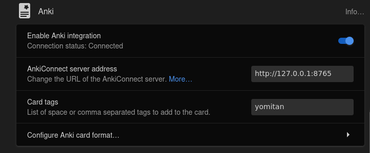
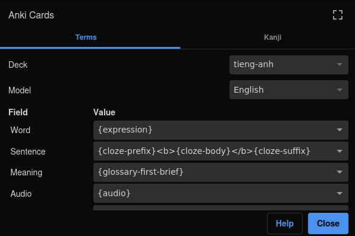
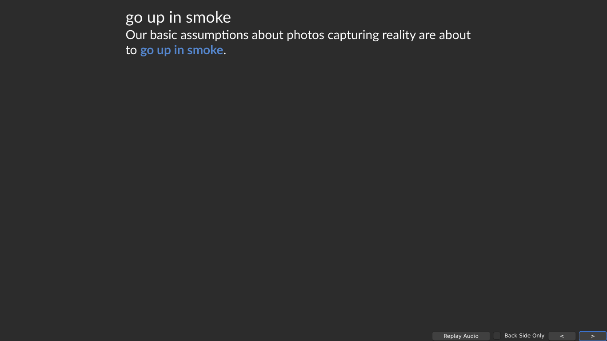
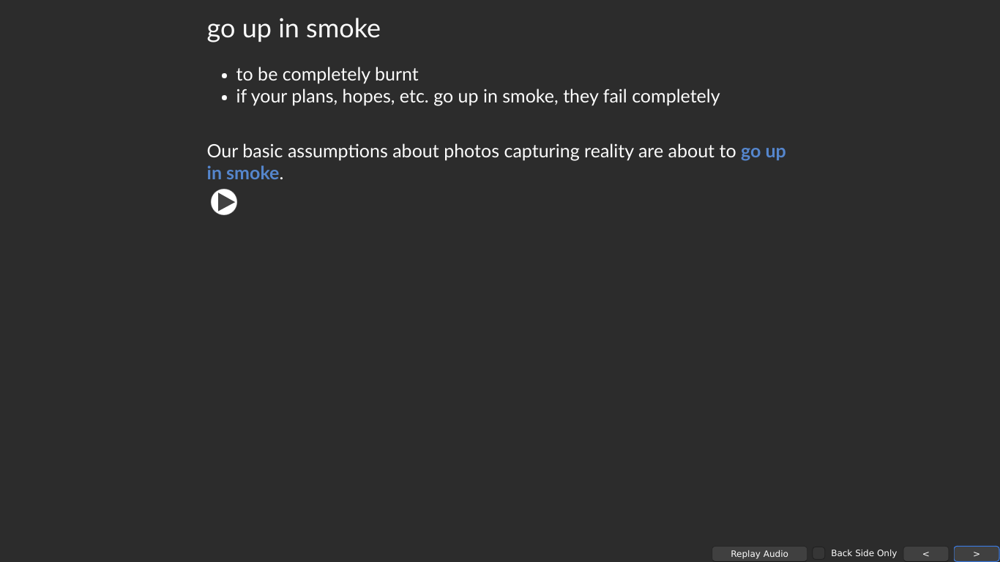

## Hướng dẫn cài đặt để chuẩn bị cho dân Immersion
Đây là một hướng dẫn nhanh cách cài đặt một số phần mềm để hỗ trợ cho việc tiêu thụ nội dung Tiếng Trung và học từ đó.

## Từ điển

### Về việc sử dụng từ điển
Từ điển là một phần rất quan trọng cần có trong quá trình học ngoại ngữ (Vì bạn đang học ngoại ngữ! Mình gợi ý nên tránh sử dụng Google Dịch, trừ khi bạn THỰC SỰ không còn lựa chọn nào khác).

Về từ điển, những ứng dụng ở đây đều đạt chỉ tiêu:

1. Hỗ trợ rất nhiều từ điển cùng một lúc. Rất quan trọng vì bạn có thể sử dụng nhiều từ điển.
2. Hoạt động ngoại tuyến: Bạn không cần kết nối mạng để sử dụng, và nó cũng rất gọn nữa

### Những lựa chọn
- Yomitan (Bản kế tiếp từ Yomichan, là một tiện ích trình duyệt Chrome & Firefox để dùng từ điển pop-up bằng cách giữ phím Shift và di chuột vào từ). Mình gợi ý Yomitan vì nó giúp tạo thẻ Anki và dùng trên trình duyệt.
- Goldendict-ng (Bản cải thiện của Goldendict) - Một ứng dụng có tuổi đời khá cũ nhưng hỗ trợ rất nhiều định dạng từ điển nên kho từ điển cho Goldendict gần như là vô tận.

### Hướng dẫn cài đặt
Bạn vào đọc hướng dẫn tải từ chính trang chủ của hai thứ ở trên. Bạn có thể tải cả hai, hoặc một trong hai đều được

- Goldendict-ng: <https://xiaoyifang.github.io/goldendict-ng/>
- Yomitan: <https://yomitan.wiki/> - Bạn chỉ cần cài đặt Yomitan trên trình duyệt thôi, còn lại như chọn từ điển Tiếng Trung, tạo mẫu thẻ và sử dụng Anki thì sẽ có hướng dẫn bên dưới.

Với Yomitan, hãy nhớ chuyển ngôn ngữ của Yomitan về Tiếng Trung (Vì mặc định sẽ là Tiếng Nhật).

### Chọn từ điển
#### Yomitan
Để tải từ điển cho Yomitan (hiện tại chỉ mới có người làm từ điển Anh - Anh), bạn hãy [truy cập vào trang này](https://github.com/MarvNC/yomitan-dictionaries?tab=readme-ov-file#mandarin-chinese) để tải (Đây là từ điển Tiếng Trung - Tiếng Anh hoặc từ điển đơn ngữ).

#### Goldendict
Để tải từ điển cho Goldendict, bạn hãy truy cập [trang tổng hợp này](https://cloud.freemdict.com/index.php/s/pgKcDcbSDTCzXCs?path=%2FCHINESE%2FChi-Vie). Có một kho rất lớn các từ điển bạn có thể tải. 

Nếu đường dẫn trên bị lỗi thì bạn ghé qua [đây](ttps://cloud.freemdict.com/index.php/s/pgKcDcbSDTCzXCs)

## Các phần mềm và tiện ích hỗ trợ khác

### Anki
Cần có - Dù mình tin là bạn có thể học mà _không sử dụng Anki_ nhưng nó thực sự quá tốn thời gian.

Anki là một công cụ quá tốt để hỗ trợ bạn ghi nhớ những gì bạn đã học. Trước khi sử dụng bạn nên xem video hướng dẫn cơ bản trước nha. 

[Hướng dẫn sử dụng căn bản](https://www.youtube.com/watch?v=M9-qwsHyBrc) - Video này đã khá cũ và giao diện của Anki cũng có phần khác nhiều nữa, nhưng tư duy về cách sử dụng và làm quen với tính năng cơ bản của Anki vẫn đáng để xem.

[Học cách tạo thẻ Anki và Sentence Mining đơn giản](https://www.youtube.com/watch?v=PLnJ1l6f7mQ)

Sau khi học xong hai video trên thì mọi người sẽ cần học cách sử dụng Yomitan với Anki nếu mọi người muốn tạo thẻ tự động.

Để có thể sử dụng Yomitan với Anki thì bạn cần tải addon AnkiConnect cho Anki, bạn tải Addon trên [trang này](https://ankiweb.net/shared/info/2055492159)

Sau đó, hãy [tải bộ thẻ mẫu bằng cách bấm vào đường dẫn này](assets/template-deck.apkg) rồi **Import** và trong Anki. Mẫu thẻ này làm cho Tiếng Anh nhưng Tiếng Trung dùng cũng được

Giờ chuyển sang Yomitan, sau khi đã cài đặt AnkiConnect như ở trên thì hãy di chuyển đến mục **Anki** trong cài đặt của Yomitan. Cần mở ứng dụng Anki khi bạn sử dụng Yomitan để tạo thẻ. Nếu bạn thành công thì sẽ có dòng **Connection Status: Connected** ở dưới dòng **Enable Anki Integration**.

Sau đó, hãy mở **Config Anki card format...**.

Về phần **Deck** và **Model** thì bạn hãy chọn **Model** là **English** (Nếu bạn tải bộ thẻ mình để ở trên), còn **Deck** là bộ thẻ mà bạn sẽ lưu các thẻ học của mình lại, bộ thẻ này thì bạn cần tự tạo bằng cách bấm vào **Create Deck** ở màn hình chính của Anki.

Tiếp theo, hãy sao chép những cài đặt sau vào mẫu thẻ (Nếu bạn sử dụng bộ thẻ mẫu mình đã để ở trên):

| Field | Value |
| --- | --- |
| `Word` | `{expression}` |
| `Sentence` | `{cloze-prefix}<b>{cloze-body}</b>{cloze-suffix}` |
| `Meaning` | `{glossary-first-brief}` |
| `Audio` | `{Audio}` |

Nó sẽ trông như thế này trong phần cài đặt của Yomitan

Khi bạn tra từ và bấm vào dấu `+` màu xanh lá cây thì nó sẽ tạo thẻ tự động trong Anki và bạn cần bật Anki khi sử dụng Yomitan để tạo thẻ (Nếu bạn chỉ tra từ mà không tạo thẻ thì không cần bật Anki nha).

Đây là một ví dụ mẫu thẻ trên Anki.

### Asbplayer

Dùng để tạo thẻ câu (sentence mining) các thứ trên Youtube hay các trang có hỗ trợ phụ đề. Đây là tiện ích trình duyệt chỉ hỗ trợ Chrome và các trình duyệt tương ứng như Edge hay Brave. [Tải tại đây](https://chromewebstore.google.com/detail/asbplayer-language-learni/hkledmpjpaehamkiehglnbelcpdflcab)

[Hướng dẫn học ngoại ngữ thông qua YouTube & Netflix](https://docs.google.com/document/d/1YaHBu5obEmn83kh20NHkWW_eOYXc7_EAPXTJmDHy1y4/edit) - Đây là hướng dẫn cách đào câu (sentence mining) thông qua asbplayer ngay trên trình duyệt (Máy tính).

### RSS Readers - Feed Aggregators

Bạn nên tải một ứng dụng hỗ trợ RSS để đọc báo, tin tức hay quản lý các cập nhật một cách gọn gàng. Bạn có thể tìm RSS của một trang tin tức, báo Tiếng Trung bất kì, cho vào Rss Reader và nó sẽ tự động cập nhật thông tin và bài viết mới cho bạn, mỗi ngày và rất nhanh chóng.

Bạn cũng có thể truy cập [vào trang tổng hợp này](https://rss.feedspot.com/chinese_news_rss_feeds/) để tìm hiểu thêm

## Tiêu thụ nội dung 

### Youtube
Bạn có thể tìm trên Youtube hoặc tải phim có phụ đề.

- [Gợi ý các kênh Youtube mà bạn có thể xem](youtube.md)
- [Một phần mềm hỗ trợ tải video Youtube về máy](https://github.com/axcore/tartube/releases/tag/v2.5.0) 

### Sách
- [Tìm gợi ý sách để đọc](sach.md) - Khá nhiều sách trong số này là miễn phí do hết hạn bản quyền, bạn có thể bấm vào tên sách và tải tệp, gợi ý nên chọn tệp `.epub` và tìm một phần mềm hỗ trợ đọc `.epub` như Calibre hoặc SumatraPDF. Nếu bạn đọc sách bằng máy đọc sách Kindle thì hãy chọn `.mobi`. 

### Podcast
- [Tìm Podcast để nghe](podcasts.md) - Một trang tổng hợp các gợi ý Podcast nên nghe từ rất nhiều nguồn 
