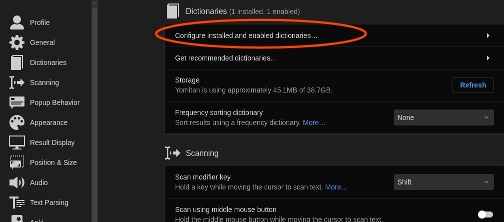

# Hướng dẫn cài đặt Yomitan

## Yomitan là gì?

Yomitan là một extension (tiện ích mở rộng) trên trình duyệt (Chrome, Chromium-based hoặc Firefox) cho phép bạn tra cứu các từ Tiếng Trung cả nghĩa lẫn cách đọc trên trang web một cách dễ dàng.

## Bắt đầu

Yomitan có thể tải ở trên cả Chromium và Firefox.

Tải tại đây:

- [Chrome Web Store](https://chromewebstore.google.com/detail/yomitan/likgccmbimhjbgkjambclfkhldnlhbnn) - Cho các trình duyệt như Chrome, Chromium, Brave, Edge hoặc bất kì trình duyệt nào dựa trên nhân Chromium
- [Firefox](https://addons.mozilla.org/en-GB/firefox/addon/yomitan/) - Cho Firefox hay các trình duyệt dựa trên Firefox như Librewolf hoặc Waterfox.

Sau khi cài xong nó sẽ mở một tab mới, bạn đóng trang đó lại và tìm Yomitan trong phần "Tiện ích mở rộng" trong trình duyệt (Hoặc Addons cho Firefox).

_nhớ phải thay đổi ngôn ngữ về Tiếng Trung (**Chinese (zh)**) nhé._

## Tải từ điển

Khi bạn mới cài Yomitan lần đầu, bạn sẽ cần cài từ điển để có thể sử dụng được Yomitan.

Những tệp này sử dụng phần mở rộng `.zip` (file extension) và **bạn không cần phải giải nén nó ra.**

### Danh sách từ điển

- Từ điển Trung - Việt: [Truy cập kho từ điển Trung - Việt cho Yomitan](https://yomitan-vi.github.io/tu-dien-trung-viet-yomitan/) (Bao gồm từ điển mtBab và VDICT).
- Từ điển chữ Hán: [HanziDictVN](https://yomitan-vi.github.io/tu-dien-hanzi-yomitan/)

### Các từ điển khác

Bạn có thể xem danh sách:

- [Từ điển Tiếng Trung cho Yomitan (`MarvNC/yomitan-dictionaries`)](https://github.com/MarvNC/yomitan-dictionaries?tab=readme-ov-file#mandarin-chinese) (Truy cập trang này để tải từ điển đơn ngữ cũng các từ điển Tiếng Trung - Tiếng Anh).
- [Kho từ điển Tiếng Trung Yomitan - Google Drive](https://drive.google.com/drive/folders/1JT6PFl6_wC-_PGCJGOOolGbieQRr5PmP)

## Cài đặt từ điển và sử dụng cơ bản

1. Bấm vào  icon trên thanh công cụ của trình duyệt.
2. Bấm vào  icon để mở cài đặt.

   

3. Chọn "Dictionaries" ở thanh sidebar bên trái rồi chọn "Configure installed and enabled dictionaries…"

   

4. Bấm vào nút "Import" ở bên dưới.

   

5. Giờ là lúc chọn các từ điển để import vào trong Yomitan (là các tệp `.zip` đó). Bạn có thể kéo thả hoặc bấm vào để chọn từ điển bạn đã tải xuống.
6. Đợi các từ điển được thêm vào. Sẽ mất một lúc (Mình làm trên Firefox thấy lâu hơn so với bên Chromium)
7. Sau khi hoàn tất, bạn có thể kiểm tra Yomitan bằng cách giữ phím ++shift++ và di chuột qua văn bản Tiếng Trung. Thử di chuột vào cái này xem: 中国话. Nó sẽ hiện một pop-up box hiển thị các định nghĩa được chia theo từ điển.
   

Bấm ra chỗ khác trên màn hình hoặc phím Esc để ẩn hộp thoại đó đi

Bạn có thể bấm vào nút  để nghe phát âm từ.

Trên thanh công cụ trình duyệt, nếu bạn chọn biểu tượng Yomitan, sau đó chọn biểu tượng  hoặc dùng tổ hợp phím tắt `Alt+ Insert`, bạn có thể truy cập vào "Yomitan Search" - bạn có thể sử dụng Yomitan như một từ điển Tiếng Trung riêng (Hoàn toàn Offline).

Có thể chỉnh kích cỡ Pop-up trong cài đặt và cả giao diện tối nữa.

## Từ điển đo độ phổ biến của từ

Yomitan hỗ trợ từ điển tần suất để cho bạn biết độ phổ biến của từ này

**Frequency - Chinese CC100** - Danh sách tần suất các từ xuất hiện trên Internet của Trung

**Thế nào là từ phổ biến?**

Rất phổ biến: 1-10,000  
Phổ biến: 10,001-20,000  
Tương đối phổ biến: 20,001-30,000  
Chắc là phổ biến: 30,001-40,000  
Không phổ biến: 40,001-50,000  
Hàng hiếm: 50,001-80,000  
Người-bản-ngữ-chắc-cũng-không-biết: 80,000+

## Cài đặt Anki

Đọc trên trang của [kuri](https://donkuri.github.io/learn-japanese/setup/#anki-setup).
